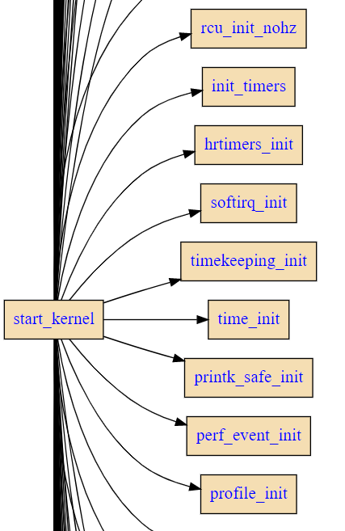

## 玩起来
首先来看`callgraph`的help:
```
./callgraph

 -f func_name
 -d directory|file
 -F filterstr
 -D depth
 -o directory
```
简单的解释一下：
`-f` 指出call graph的根节点的函数名字
`-d` 指出需要扫描的文件或者文件夹
`-F` 过滤掉不想要的函数
`-D` 指定扫描的文件夹深度
`-o` 指定输出文件名，默认的命名规则是<根节点函数名>.svg

`callgraph -f start_kernel -d init/main.c -F "printk boot_cpu_init rest_init" -D 2`

```
$ callgraph -f start_kernel -d init/main.c -F "printk boot_cpu_init rest_init" -D 2
Func: start_kernel
Match: 1
File:
     0  All files under init/main.c
     1  init/main.casmlinkage __visible void __init start_kernel(void)
Select: 0 ~ 1 ? 0
Command: cflow -b  -d 2  -m start_kernel init/main.c  | /usr/local/bin//tree2dotx printk boot_cpu_init rest_init 2>/dev/null | dot -Tsvg -o .//start_kernel.all.svg
cflow:init/main.c:120: __read_mostly redefined
cflow:init/main.c:118: this is the place of previous definition
cflow:init/main.c:149: __read_mostly redefined
cflow:init/main.c:120: this is the place of previous definition
cflow:init/main.c:817: initcall_blacklist/1 redefined
cflow:init/main.c:767: this is the place of previous definition
cflow:init/main.c:823: initcall_blacklisted/1 redefined
cflow:init/main.c:789: this is the place of previous definition
cflow:init/main.c:856: initcall_debug_enable/1 redefined
cflow:init/main.c:506: this is the place of previous definition
cflow:init/main.c:1061: mark_readonly/1 redefined
cflow:init/main.c:1045: this is the place of previous definition
Target: init/main.c : start_kernel -> .//start_kernel.all.svg
```


## 原理
callgraph 实际上只是灵活组装了三个工具，一个是 cflow，一个是 tree2dotx，另外一个是 dot。

### cflow：拿到函数调用关系
`cflow -b -m start_kernel init/main.c > start_kernel.txt`

### tree2dotx: 把函数调用树转换成 dot 格式
`cat start_kernel.txt | tree2dotx > start_kernel.dot`

### 用 dot 工具生成可以渲染的图片格式
用 dot 工具生成可以渲染的图片格式:
`cat start_kernel.dot | dot -Tsvg -o start_kernel.svg`
实际上 dot 支持非常多的图片格式，请参考它的手册：`man dot`

## 趣玩 tree2dotx
展示目录结构:
`$ tree -I '*.h|README.rst|scripts*|include*' -f -n | tree2dotx  | dot -Tsvg -o tree.svg`


